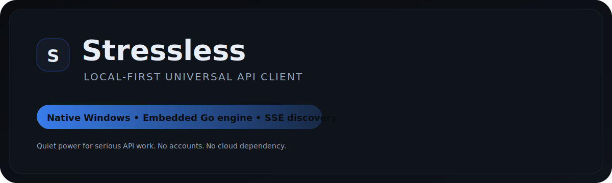
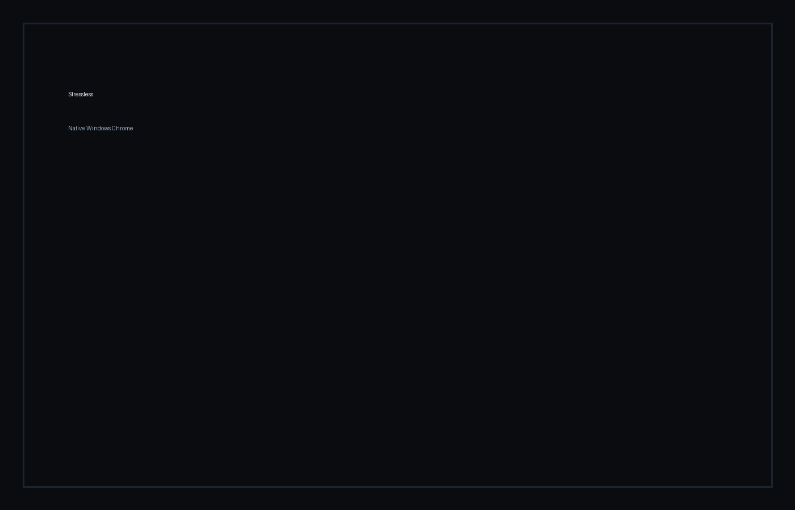

<p align="center">
  
</p>

<p align="center">
  <b>Stressless</b> is a native, local-first API client built for focused engineering work.
  <br/>
  <sub>Quiet power. Predictable behavior. Professional ergonomics.</sub>
</p>

<p align="center">
  
  
  
  
</p>

---

---

## Operational reality

Stressless is not a toy, a dashboard, or a cloud funnel.

It is a **local execution surface**.

- No accounts to revoke
- No servers to shut down
- No telemetry to sanitize
- No vendors to call at 03:17

Every request executes where you are.
Every response is yours to interpret.
Nothing leaves the machine unless you send it.

This is intentional.

---

## Threat model (explicit)

Stressless assumes:

- hostile networks
- unreliable connectivity
- audited environments
- engineers who do not want surprises

Design decisions follow from this:

- Local-first by default
- Embedded engine, not plugins
- Minimal surface area
- No background services
- No silent updates

---

## Why this exists

Most API tools are built for demos.

Stressless is built for:
- incident response
- regulated environments
- long-running investigations
- engineers who already know what they are doing

If you need onboarding, tutorials, or gamification,
this tool is not for you.

---

## Non-goals

Stressless does not aim to:

- replace Postman for teams
- provide cloud sync
- track usage
- collect metrics
- monetize data

Those features introduce ambiguity.

Stressless removes ambiguity.

---

Stressless is calm software for stressful situations.


## Releases

Pre-built Windows binaries will be published on the Releases page.

- **v0.1.0-alpha** – portable Windows build (first public alpha)

Release notes live in `RELEASES/`.

---

## Why Stressless

Most API tools optimize for friendliness and feature sprawl.
Stressless optimizes for **signal**, **clarity**, and **trust**.

- **Local-first**: runs fully on your machine
- **No accounts**: no logins, no cloud dependency
- **Predictable**: fewer moving parts, fewer surprises
- **Engine-backed**: embedded Go backend designed for correctness

---

## Core capabilities

- Universal REST client
- Syntax-highlighted JSON responses
- Local preset storage
- Endpoint discovery via **SSE**
- Native Windows shell (**WPF + WebView2**)
- Portable distribution (and installer workflow ready)

---

## Screenshots




---

## Architecture

```
Stressless (WPF)
└── Embedded Web UI
    └── Go API Engine
        ├── Request proxy
        ├── Preset storage
        └── Discovery engine (SSE)
```

The desktop shell exists to disappear.
The engine does the work.

---

## Build (developers)

Backend:
```bash
cd apps/server-go
go run ./cmd/server
```

Windows portable:
```powershell
powershell -ExecutionPolicy Bypass -File scripts\build_windows_portable.ps1
```

---

## Security & signing (alpha)

Stressless supports free, practical code signing for early alpha.

- Guide: `SIGNING.md`
- A self-signed certificate is acceptable for internal pilots and investor demos.
- SmartScreen reputation requires paid EV signing and is intentionally deferred.

---

## Vision

Stressless aims to be the reference desktop tool for serious API work.

The long-term goal is simple:
- predictable behavior
- local-first security
- professional-grade ergonomics

Stressless is not trying to replace every tool.
It is trying to be the one you trust.

---

## Repo map

```
apps/server-go/        Go engine + embedded UI
apps/windows-wpf/      Native Windows shell (WPF)
branding/              Logos, icons, social preview
docs/                  Screens, notes, media kit
installer/             Inno Setup scaffolding
scripts/               Build + repair scripts
```

---

© bspippi1337
